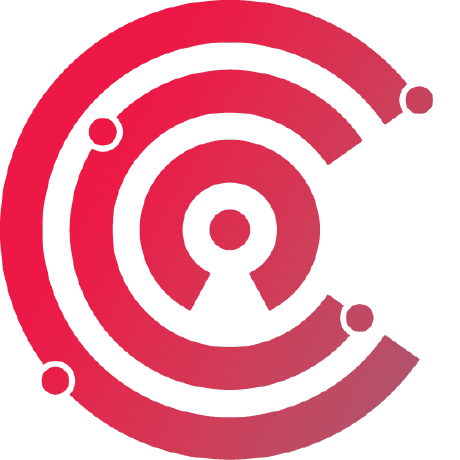

# CCC Attestation SIG

This is the home of the [Confidential Computing Consortium](https://confidentialcomputing.io) (CCC) Attestation Special Interest Group (SIG).

## Meetings

We hold public fortnightly meetings.
Check the [meetings page](https://github.com/ccc-attestation/meetings) for pointers to previous presentations and to the agenda, which includes the details for how to join the calls.

## Completed Sub-Projects
* [Formal Specification of Attestation in Confidential Computing](https://github.com/ccc-attestation/formal-spec-TEE)

## Active Sub-Projects

Currently, we have three active sub-projects:

* [Attested TLS proof-of-concept](https://github.com/ccc-attestation/attested-tls-poc)
* [RA-TLS harmonisation](https://github.com/ccc-attestation/interoperable-ra-tls)
* [Formal specification and verification of the Confidential Containers KBS protocol](https://github.com/CCC-Attestation/formal-spec-KBS)

Check our [issue tracker](https://github.com/ccc-attestation/governance/issues) for any pending project proposal.
